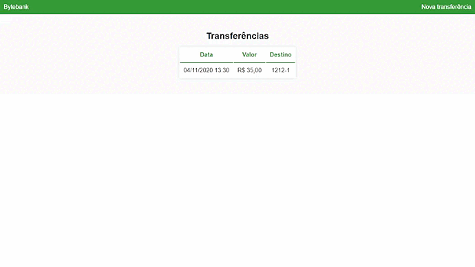

<h1 align="center">Bytebank</h1>

<h1 align="center">
  
</h1>

## 💻 Projeto

Bytebank é um sistema desenvolvido para cadastrar e visualizar o extrato de transferências bancárias.

## ✨ Tecnologias

Esse projeto foi desenvolvido com as seguintes tecnologias:

- [Angular](https://angular.io/docs)

## :memo: Pré requisitos

- [Angular CLI](https://angular.io/cli)
- [json-server](https://www.npmjs.com/package/json-server)
- [Node.js](https://nodejs.org/en/)
